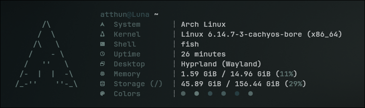

    
    

<h1 align="center">Microfetch but Arch Linux</h1>

Stupidly simple, laughably fast fetch tool. But the Arch Linux version...

  

## Installation

> [!NOTE]
> You will need a Nerdfonts patched font installed, and for your terminal
> emulator to support said font. Microfetch uses nerdfonts glyphs by default.

Thanks to [@NotAShelf](https://github.com/NotAShelf) - For the original project

## License

Microfetch is licensed under [GPL3](LICENSE). See the license file for details.
